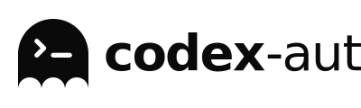
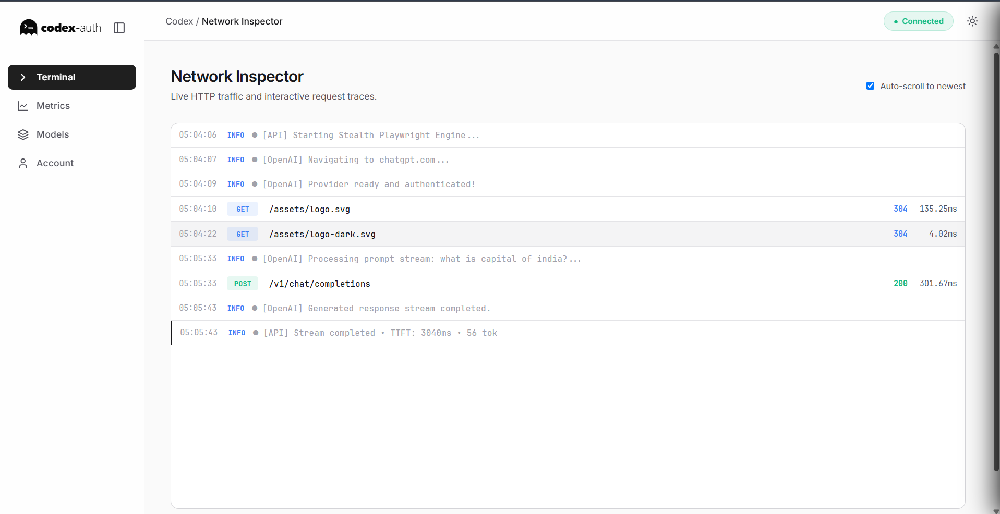
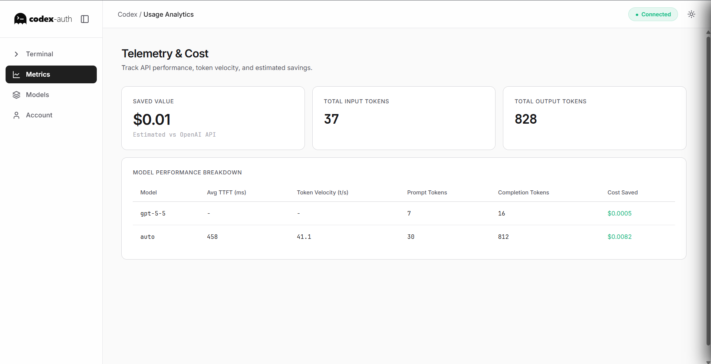
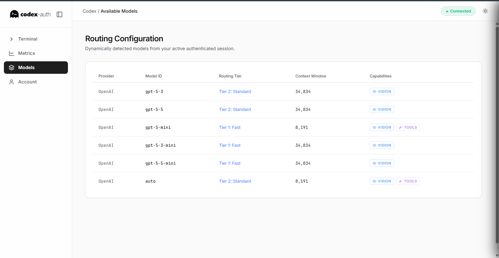
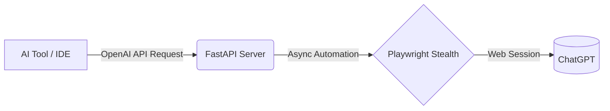

<div align="center">
  <picture>
    <source media="(prefers-color-scheme: dark)" srcset="assets/logo-dark.svg">
    <source media="(prefers-color-scheme: light)" srcset="assets/logo.svg">
    
  </picture>
  
  # Codex-Auth
  
  **A Stealth Playwright proxy providing an OpenAI-compatible API layer over ChatGPT.**
  
  [](https://python.org)
  [](https://fastapi.tiangolo.com/)
  [](https://playwright.dev/)
  [](#license)
</div>

<br />

Codex-Auth is a Python package that provides an OpenAI-compatible API proxy backed by a ChatGPT web session. By utilizing Stealth Playwright, it exposes a local API layer that can be connected to AI tools and IDEs like Cursor and OpenRouter.

## 📑 Table of Contents
- [✨ Features](#-features)
- [🚀 Getting Started](#-getting-started)
- [💻 Usage](#-usage)
- [📸 Screenshots](#-screenshots)
- [🔌 Connecting Tools](#-connecting-tools)
- [🏗️ Architecture](#️-architecture)
- [📜 License](#-license)

## ✨ Features

- 🎭 **Stealth Automation**: Uses `playwright-stealth` to navigate automated bot detection.
- 🔄 **OpenAI Compatible**: Supports OpenAI's `/v1/chat/completions` and `/v1/models` endpoints.
- 🖼️ **Vision & Multimodal**: Scrapes internal endpoints to report model vision capabilities.
- ⚡ **Asynchronous Core**: Built on FastAPI for non-blocking request handling.
- 📦 **CLI Tool**: Includes the `codex-auth` CLI built with Typer & Rich for setup and execution.

## 🚀 Getting Started

### Option 1: Python Developers (Recommended)
If you have Python installed, use `pipx` to install Codex-Auth globally in an isolated environment. This prevents dependency conflicts with your other Python packages.

```bash
pipx install codex-auth
codex-auth install
```

### Option 2: Standalone Binary (Windows)
If you don't have Python installed, or just want a frictionless setup, download the compiled `.exe`:

1. Go to the [Releases page](https://github.com/yutuknown/codex-auth/releases)
2. Download `codex-auth.exe`
3. Open your terminal and run it directly to install the bundled browser:
```bash
codex-auth.exe install
```

## 💻 Usage

Codex-Auth provides a command-line interface for managing the proxy.

### 1. Authenticate

Before running the proxy server, you need to capture a valid ChatGPT session token. 

```bash
codex-auth auth
```
*This command launches a headless browser. Follow the prompts to log in to your account. Session tokens are saved to the local `.codex` directory.*

### 2. Start the Proxy Server

Once authenticated, start the API server:

```bash
codex-auth start --port 8000
```
*The proxy will listen on `http://127.0.0.1:8000`.*

## 📸 Screenshots

| Authentication Setup | API Server Logs | CLI Chat Interface |
| :---: | :---: | :---: |
|  |  |  |

## 🔌 Connecting Tools

You can configure Codex-Auth as a custom OpenAI provider in standard AI tools.

Example configuration:
- **Base URL**: `http://127.0.0.1:8000/v1`
- **API Key**: `sk-codex-dummy` *(The proxy accepts any string)*

The proxy intercepts API requests and routes them through the authenticated ChatGPT web session.

## 🏗️ Architecture



- **FastAPI**: Handles API routing.
- **Playwright**: Drives the browser interaction.
- **Typer & Rich**: Powers the CLI interface.

## 📜 License
Distributed under the MIT License. See `LICENSE` for more information.
