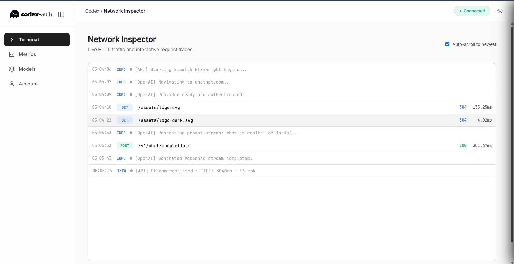
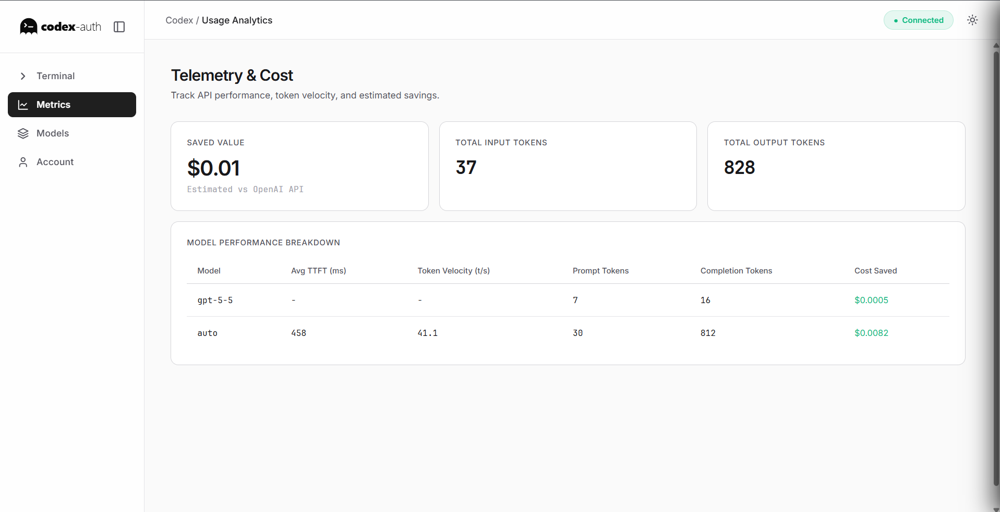
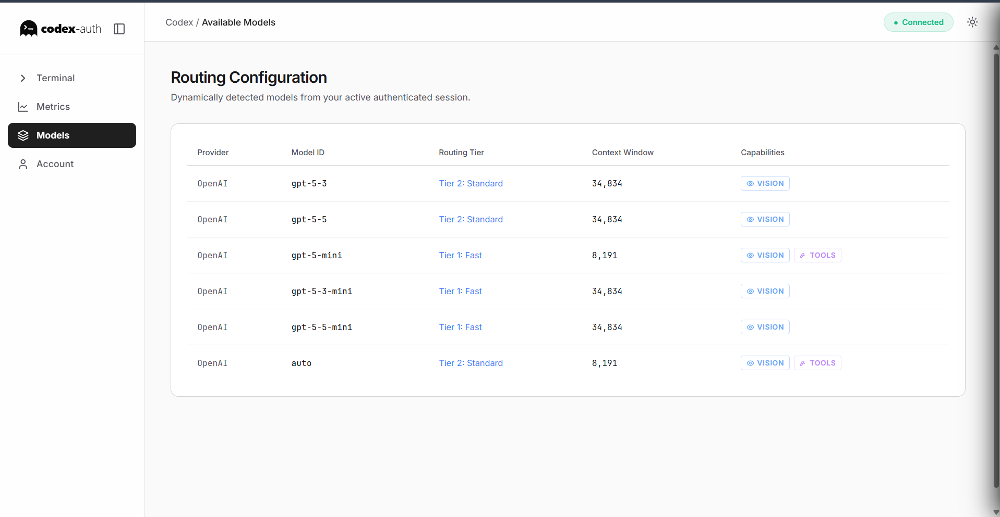
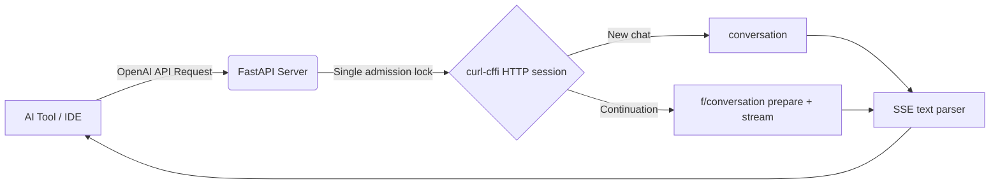

<div align="center">
  <picture>
    <source media="(prefers-color-scheme: dark)" srcset="assets/logo-dark.svg">
    <source media="(prefers-color-scheme: light)" srcset="assets/logo.svg">
    
  </picture>

  # Codex-Auth

  **A low-memory HTTP proxy providing an OpenAI-compatible API layer over ChatGPT.**

  [](https://python.org)
  [](https://fastapi.tiangolo.com/)
  [](https://github.com/lexiforest/curl_cffi)
  [](#license)
</div>

<br />

Codex-Auth is a Python package that provides an OpenAI-compatible API proxy
backed by a ChatGPT web session. It uses direct HTTP requests and an incremental
SSE parser, so Chromium and Playwright are not required at runtime.

> ChatGPT's web endpoints are undocumented and can change without notice. A
> ChatGPT subscription is not an OpenAI API subscription.

## 📑 Table of Contents

- [✨ Features](#-features)
- [🚀 Getting Started](#-getting-started)
- [💻 Usage](#-usage)
- [☁️ Deploy on Render](#️-deploy-on-render)
- [📸 Screenshots](#-screenshots)
- [🔌 Connecting Tools](#-connecting-tools)
- [🏗️ Architecture](#️-architecture)
- [📜 License](#-license)

## ✨ Features

- 🍪 **Cookie Authentication**: Loads a Netscape-format ChatGPT `cookies.txt`.
- 🔄 **OpenAI Compatible**: Supports `/v1/chat/completions` and `/v1/models`.
- 🪶 **Low Memory**: No browser process, renderer, DOM, or JavaScript heap.
- ⚡ **Streaming Core**: Reconstructs assistant text from ChatGPT SSE events.
- 📊 **Dashboard**: Browser login protects runtime logs, usage, and model status.
- 📦 **CLI Tool**: Includes the `codex-auth` CLI built with Typer and Rich.

HTTP-only mode supports text, streaming, image/file attachments, and explicit
web search without launching Chromium. Uploads accept data URLs, raw base64,
or public HTTP(S) URLs up to 20 MB.

## 🚀 Getting Started

### Option 1: Python Developers (Recommended)

```bash
pipx install codex-auth-proxy
codex-auth install
```

The install command confirms that no browser download is needed.

### Option 2: Editable Development Install

```bash
git clone https://github.com/yutuknown/codex-auth.git
cd codex-auth
python -m pip install -e .
```

## 💻 Usage

### 1. Authenticate

Export your signed-in `chatgpt.com` cookies in Netscape HTTP Cookie File format
and save them at:

```text
.codex/cookies.txt
```

The `.codex` directory is ignored by Git. Never commit or share this file.
Alternatively, set `CODEX_AUTH_COOKIE_FILE` to a different path.

### 2. Start the Proxy Server

```bash
codex-auth start --port 8000
```

The OpenAI-compatible base URL is `http://127.0.0.1:8000/v1`.

### 3. Test a Completion

```bash
curl http://127.0.0.1:8000/v1/chat/completions \
  -H "Content-Type: application/json" \
  -d '{"model":"gpt-5-3","messages":[{"role":"user","content":"Reply with OK"}]}'
```

When `CODEX_AUTH_API_KEY` is configured, also send:

```text
Authorization: Bearer <CODEX_AUTH_API_KEY>
```

### 4. Open the Dashboard

Visit `/login`, enter `CODEX_AUTH_API_KEY`, and the server creates a secure
HttpOnly dashboard session. The raw key is not stored in the browser cookie.

## ☁️ Deploy on Render

The included `Dockerfile` has no browser dependencies, and `render.yaml` uses
Render's Free plan.

1. Create a Render Blueprint or Docker web service from this repository.
2. Set `CODEX_AUTH_COOKIES` to the complete Netscape cookie-file contents.
3. If Render cannot perform the cookie-to-token exchange, set
   `CODEX_AUTH_ACCESS_TOKEN` from the same authenticated browser session.
4. Generate a private `CODEX_AUTH_API_KEY`.
5. Replace the cookies and access token when the ChatGPT session expires.

The health check is `GET /healthz`. Secrets must remain in Render environment
variables and must never be committed.

See [`docs/low-memory-architecture.md`](docs/low-memory-architecture.md) for the
request algorithm and memory characteristics.

## 📸 Screenshots

| Authentication Setup | API Server Logs | CLI Chat Interface |
| :---: | :---: | :---: |
|  |  |  |

## 🔌 Connecting Tools

Configure any OpenAI-compatible client with:

- **Base URL**: `http://127.0.0.1:8000/v1` or your Render URL followed by `/v1`
- **API Key**: `CODEX_AUTH_API_KEY`
- **Model**: A slug returned by `GET /v1/models`

## 🏗️ Architecture


```mermaid
graph LR
    A[AI Tool / IDE] -->|OpenAI API Request| B(FastAPI Server)
    B -->|Single admission lock| C{curl-cffi HTTP session}
    C -->|New chat| D[conversation]
    C -->|Continuation| E[f/conversation prepare + stream]
    D --> F[SSE text parser]
    E --> F
    F --> A
```

- **FastAPI** handles API routing, API-key checks, and the dashboard.
- **curl-cffi** maintains the authenticated HTTP cookie session.
- **The SSE parser** emits assistant text without loading a browser page.
- **Typer and Rich** power the CLI.

## 🤝 Contributors

- [@yutuknown](https://github.com/yutuknown) - Creator & Lead Developer
- **Antigravity AI** - AI Pair Programmer

## 📜 License

Distributed under the MIT License. See `LICENSE` for more information.
