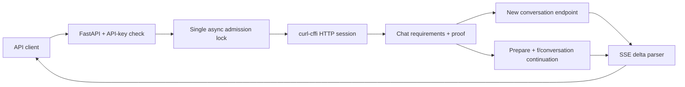

# Codex-Auth

Codex-Auth exposes an OpenAI-compatible API backed by an authenticated
ChatGPT web session. It talks to ChatGPT over HTTP with `curl-cffi`; Chromium
and Playwright are not used at runtime.

> This project calls undocumented ChatGPT web endpoints. They can change
> without notice. A ChatGPT subscription is not an OpenAI API subscription,
> and you are responsible for complying with the applicable terms.

## What it provides

- `POST /v1/chat/completions` (streaming and non-streaming text)
- `GET /v1/models`
- Ollama-compatible `/api/chat`, `/api/tags`, and `/api/show`
- Netscape `cookies.txt` authentication
- A single-request admission lock for predictable low RAM usage
- Optional `CODEX_AUTH_API_KEY` protection

File uploads and web search are rejected in HTTP-only mode instead of silently
falling back to a browser.

## Authentication

Export your signed-in `chatgpt.com` cookies in Netscape HTTP Cookie File format
and save them as:

```text
.codex/cookies.txt
```

The file is ignored by Git. Never commit, paste into logs, or share it. The
session cookie grants access to your ChatGPT account and will eventually
expire.

For a different local path, set `CODEX_AUTH_COOKIE_FILE`. For hosted services,
set the complete file contents in the secret environment variable
`CODEX_AUTH_COOKIES`.

## Run locally

```bash
python -m pip install -e .
codex-auth start --port 8000
```

Test it:

```bash
curl http://127.0.0.1:8000/v1/chat/completions \
  -H "Content-Type: application/json" \
  -d '{"model":"gpt-5-3","messages":[{"role":"user","content":"Reply with OK"}]}'
```

If `CODEX_AUTH_API_KEY` is set, also send
`Authorization: Bearer <your-key>`.

## Deploy on Render

The included `Dockerfile` contains no browser and the Blueprint uses Render's
Free plan.

1. Create a Render Blueprint or Docker web service from this repository.
2. Set secret `CODEX_AUTH_COOKIES` to the full Netscape cookie-file contents.
3. Keep `CODEX_AUTH_API_KEY` enabled and private.
4. When the ChatGPT session expires, replace `CODEX_AUTH_COOKIES` and redeploy.

The health check is `GET /healthz`. See
[`docs/low-memory-architecture.md`](docs/low-memory-architecture.md) for the
request algorithm and memory characteristics.

## HTTP flow


```mermaid
flowchart LR
    C[API client] --> A[FastAPI + API-key check]
    A --> L[Single async admission lock]
    L --> H[curl-cffi HTTP session]
    H --> S[Chat requirements + proof]
    S --> N[New conversation endpoint]
    S --> P[Prepare + f/conversation continuation]
    N --> E[SSE delta parser]
    P --> E
    E --> C
```

New chats use `/backend-api/conversation`. Once ChatGPT returns a registered
conversation ID and parent message ID, continuation turns use
`/backend-api/f/conversation/prepare` followed by
`/backend-api/f/conversation`.

## License

MIT. See [`LICENSE`](LICENSE).
