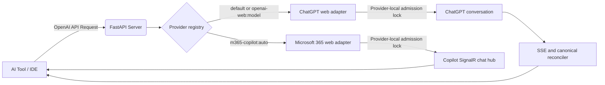

<div align="center">
  <picture>
    <source media="(prefers-color-scheme: dark)" srcset="assets/logo-dark.svg">
    <source media="(prefers-color-scheme: light)" srcset="assets/logo.svg">
    
  </picture>

  # Codex-Auth

  **A low-memory, provider-routed compatibility API for authenticated AI sessions.**

  [](https://python.org)
  [](https://fastapi.tiangolo.com/)
  [](https://github.com/lexiforest/curl_cffi)
  [](#license)
</div>

<br />

Codex-Auth is a Python package that provides an OpenAI-compatible API proxy.
Its shipped providers support authenticated ChatGPT Web and Microsoft 365
Copilot Chat sessions behind one namespaced model catalog. It uses direct HTTP,
SSE, and WebSocket transports, so Chromium and Playwright are not required at
runtime.

> ChatGPT's web endpoints are undocumented and can change without notice. A
> ChatGPT subscription is not an OpenAI API subscription.

## 📑 Table of Contents

- [✨ Features](#-features)
- [🚀 Getting Started](#-getting-started)
- [💻 Usage](#-usage)
- [☁️ Deploy on Render](#️-deploy-on-render)
- [📸 Screenshots](#-screenshots)
- [🔌 Connecting Tools](#-connecting-tools)
- [🏗️ Architecture](#️-architecture)
- [📜 License](#-license)

## ✨ Features

- 🍪 **Cookie Authentication**: Loads a Netscape-format ChatGPT `cookies.txt`.
- 🔄 **OpenAI Compatible**: Supports `/v1/chat/completions` and `/v1/models`.
- 🪶 **Low Memory**: No browser process, renderer, DOM, or JavaScript heap.
- ⚡ **Streaming Core**: Reconstructs assistant text from ChatGPT SSE events.
- 📊 **Dashboard**: Browser login protects runtime logs, usage, and model status.
- 🔐 **Session Refresh**: Validates and activates pasted or uploaded `cookies.txt`
  exports without restarting the service.
- 📦 **CLI Tool**: Includes the `codex-auth` CLI built with Typer and Rich.

HTTP-only mode supports text and canonical streaming without launching
Chromium. Attachment and web-search availability depends on the authenticated
ChatGPT account and upstream permissions. Generic function tools, Canvas, and
image-generation responses are not yet exposed by the proxy.

## 🚀 Getting Started

### Option 1: Python Developers (Recommended)

```bash
pipx install codex-auth-proxy
codex-auth install
```

The install command confirms that no browser download is needed.

### Option 2: Editable Development Install

```bash
git clone https://github.com/yutuknown/codex-auth.git
cd codex-auth
python -m pip install -e .
```

## 💻 Usage

### 1. Authenticate

Export your signed-in `chatgpt.com` cookies in Netscape HTTP Cookie File format
and save them at:

```text
.codex/cookies.txt
```

The `.codex` directory is ignored by Git. Never commit or share this file.
Alternatively, set `CODEX_AUTH_COOKIE_FILE` to a different path.

For Microsoft 365 Copilot, save the Netscape cookie export at
`.codex/m365-cookies.txt` and the current Copilot connection metadata at
`.codex/m365-auth.json`. A captured OAuth refresh exchange can be stored at
`.codex/m365-oauth.json`, then select a namespaced model such as
`m365-copilot:auto` or `m365-copilot:gpt-5.5-think-deeper`. Render deployments
can provide the same values through
`CODEX_AUTH_M365_COOKIES`, `CODEX_AUTH_M365_AUTH_JSON`, and
`CODEX_AUTH_M365_OAUTH_JSON`.

The Account dashboard is provider-first: it exposes separate connection,
model, credential-health, and account views for each registered provider.
Microsoft 365 profile data is optional and read-only. Configure
`CODEX_AUTH_M365_GRAPH_JSON` for a Graph `User.Read` access token and, when a
durable refresh flow is available, `CODEX_AUTH_M365_GRAPH_OAUTH_JSON`. A
missing or expired Graph profile token never prevents Microsoft 365 chat
generation.

The provider discovers the current account-visible Microsoft model selector
from authenticated `GET https://m365.cloud.microsoft/chat` hydration data. The
result is cached for 15 minutes and safely falls back to the last known catalog
if a refresh fails. Use `GET /v1/models?refresh=true` or
`GET /api/providers/m365-copilot/models?refresh=true` to force a refresh.

The Microsoft 365 web cookies validate the signed-in web shell, but they do not
contain the OAuth refresh token used by the site. The bearer in
`m365-auth.json` is short-lived. When `m365-oauth.json` is present, the adapter
uses the captured `grant_type=refresh_token` exchange before expiry, rotates
both returned tokens atomically, and keeps the browser-free runtime renewable.
Without it, the adapter reports `generation_ready: false` after the bearer
expires instead of pretending a cookie-only session can generate.

### 2. Start the Proxy Server

```bash
codex-auth start --port 8000
```

The OpenAI-compatible base URL is `http://127.0.0.1:8000/v1`.

### 3. Test a Completion

```bash
curl http://127.0.0.1:8000/v1/chat/completions \
  -H "Content-Type: application/json" \
  -d '{"model":"gpt-5-3","messages":[{"role":"user","content":"Reply with OK"}]}'
```

When `CODEX_AUTH_API_KEY` is configured, also send:

```text
Authorization: Bearer <CODEX_AUTH_API_KEY>
```

### 4. Open the Dashboard

Visit `/login`, enter `CODEX_AUTH_API_KEY`, and the server creates a secure
HttpOnly dashboard session. The raw key is not stored in the browser cookie.

The Account page can replace an expired session by pasting a Netscape cookie
export or selecting `cookies.txt`. The server validates the replacement against
the account endpoints before atomically activating it. Cookie values are not
returned by the API or included in request traces.

For the one active personal Microsoft 365 account, the selected Microsoft 365
provider card also has a separate **Generation credentials** control. Import
the existing `m365-auth.json` record and `m365-oauth.json` refresh-exchange
record together. It reports only lifecycle metadata (`active`, `expiring soon`,
`refreshing`, `refresh failed`, or `re-import required`), never token values.
You can refresh the running service immediately or explicitly clear its local
runtime copy. On Render, dashboard imports and rotated credentials are
temporary: update both `CODEX_AUTH_M365_AUTH_JSON` and
`CODEX_AUTH_M365_OAUTH_JSON` secrets to survive a restart or deploy.

### Local M365 bearer-only beta

`beta/` contains a deliberately isolated, cookie-free M365 SignalR experiment.
It is not part of the production registry. A separately configured Render beta
is still beta-only: its authoritative capability contract is
`GET /v1/capabilities`, which promotes a feature to `verified_live` only after
a redacted verification manifest for that exact deployed commit. Historical
audit prose is not a live promotion. Create a fresh
local `beta/ms365-auth.json` from the redacted example. The beta derives the
SignalR identity and OAuth renewal metadata from that OAuth response and never
reads `.codex`, browser cookies, or production credentials. An optional `route`
override can be embedded in the same JSON if Microsoft changes its claims.
Check only safe readiness state with:

```bash
python beta/m365_bearer.py status
```

The live proof is intentionally opt-in and sends one harmless text prompt:

```powershell
$env:CODEX_AUTH_M365_BETA_CONFIRM = "1"
python beta/m365_bearer.py probe
```

Inspect a real prompt's redacted frame schema without printing response text,
tokens, URLs, headers, or identity:

```powershell
$env:CODEX_AUTH_M365_BETA_CONFIRM = "1"
python beta/m365_bearer.py inspect --model gpt-5.5-think-deeper --prompt "Solve 29 * 31 carefully."
```

The inspector converts replacement snapshots into provider-lane deltas. Text
and provider-authored reasoning progress remain separate; it does not invent a
`thoughtSignature` that M365 did not send.

File upload uses a separate, optional Microsoft Graph access token under
`resources.graph` in the same ignored JSON file. Check readiness or run the
OneDrive upload stages with:

```powershell
python beta/m365_files.py status
$env:CODEX_AUTH_M365_BETA_CONFIRM = "1"
python beta/m365_files.py upload .\path\to\file.txt
```

The uploader reproduces the observed zero-cookie Graph upload-session headers,
creates a OneDrive `copilotuploads` session, and performs extraction warmup.
It reports only a safe HTTP phase when rejected. File input remains
`implemented_unverified` until the hosted exact-commit campaign proves upload,
extraction, annotation binding, and marker readback with its Graph bearer.

The compatibility service now acquires that Graph resource bearer from the
same renewable Microsoft broker session when it is absent or expired. This
removes the need to manage a second refresh token, but it does not remove the
separate Graph permission/resource boundary.

Images use a separate path and do not require the Graph credential. The beta
uploads supported image MIME types directly to Substrate with the Sydney bearer
and is structured to carry the returned conversation identity into SignalR.
Its advertised state is evidence-driven: image input and generated artifacts
remain unverified until a matching hosted run records safe structural proof.

Run the local compatibility API on loopback:

```powershell
$env:CODEX_AUTH_M365_BETA_CONFIRM = "1"
python -m uvicorn beta.m365_compat:app --host 127.0.0.1 --port 8090
```

It exposes:

- `GET /v1/models` with source-labelled M365 availability. Aliases are resolved
  before validating the canonical model and cannot create unavailable models.
- `POST /v1/messages` with Anthropic Messages streaming. M365
  `addToChainOfThought` progress becomes a `thinking` block with
  `thinking_delta` events.
- `POST /v1/chat/completions` with OpenAI-compatible streaming. The same
  provider-authored progress appears in `delta.reasoning_content`.
- Anthropic/OpenAI image input through the implemented Sydney upload path. Non-image
  file blocks use the proven Graph path and require `resources.graph` in the
  ignored local credential. Unsupported sampling, `max_tokens`,
  `thinking`, stop sequences, tools, and tool choice are rejected explicitly.
- `GET /v1/verification` reports the running commit and a redacted proof digest.
- `GET /v1/research` lists unproven model, quota, tool, output-image, and
  native-history contracts without guessing endpoint shapes.
- `GET /health` with only safe lifecycle metadata.
- `GET /v1/deployment-readiness` with restart persistence, Graph acquisition,
  unsigned-reasoning, compiled-history, and caller-tool boundaries.

Both endpoints keep reasoning-summary and answer lanes separate. They never
invent `signature_delta`, `thoughtSignature`, raw chain-of-thought, or token
usage that M365 did not provide. Safe citations, suggestions, plugin/code/image
status are retained under `provider_metadata.m365`; protected URLs are dropped.
Verified image bytes may be returned as bounded in-memory base64 artifacts;
unretrievable references remain metadata only.

When Microsoft's SPA refresh window requires a new authorization-code cycle,
export the new response JSON locally and import it without printing secrets:

```powershell
python -m beta.m365_auth_recovery .\new-m365-oauth-response.json
```

The command atomically replaces `beta/ms365-auth.json` while preserving the
captured route metadata. Both files remain ignored local beta material.

Inspect the model catalog without making an upstream request:

```powershell
python beta/m365_models.py status
python beta/m365_models.py list
```

The optional `model_catalog` and `model_aliases` blocks in
`beta/ms365-auth.json` can hold an account-captured selector snapshot and local
aliases. The API clearly identifies `authenticated_chat_shell`,
`captured_chat_shell`, `live_probe`, or `fallback`; only the first is dynamic.
Detailed comparison with Antigravity is in `beta/MODEL_MAPPING_AUDIT.md`.

Historical evidence is recorded in `beta/CAPABILITY_AUDIT.md`; current hosted
evidence is only the matching-commit digest returned by `/v1/verification`.

The beta never loads cookies and must not be treated as production-ready unless
the probe completes successfully with zero cookies.

For a hosted beta, seed credentials with
`CODEX_AUTH_M365_BETA_AUTH_JSON`. Refresh rotation stays only in process memory
unless `CODEX_AUTH_M365_BETA_STATE_FILE` points to mounted persistent storage.
The readiness endpoint intentionally reports `ready: false` when rotation is
not restart-durable. Do not place either value in source control or dashboard
markup. Historical OpenAI tool messages and Anthropic `tool_result` blocks are
preserved as labelled conversation context; caller-defined tool invocation is
still rejected before any upstream prompt is submitted.

## ☁️ Deploy on Render

The included `Dockerfile` has no browser dependencies, and `render.yaml` uses
Render's Free plan.

1. Create a Render Blueprint or Docker web service from this repository.
2. Set `CODEX_AUTH_COOKIES` to the complete Netscape cookie-file contents.
3. If Render cannot perform the cookie-to-token exchange, set
   `CODEX_AUTH_ACCESS_TOKEN` from the same authenticated browser session.
4. Generate a private `CODEX_AUTH_API_KEY`.
5. Replace the cookies and access token when the ChatGPT session expires.

The health check is `GET /healthz`. Secrets must remain in Render environment
variables and must never be committed.

Dashboard cookie replacement takes effect immediately and writes the configured
cookie file. Render's default filesystem is ephemeral, so also update the
`CODEX_AUTH_COOKIES` environment secret—or attach a persistent disk—if the new
cookies must survive a restart or redeploy.

See [`docs/low-memory-architecture.md`](docs/low-memory-architecture.md) for the
request algorithm and memory characteristics.

## 📸 Screenshots

| Authentication Setup | API Server Logs | CLI Chat Interface |
| :---: | :---: | :---: |
|  |  |  |

## 🔌 Connecting Tools

Configure any OpenAI-compatible client with:

- **Base URL**: `http://127.0.0.1:8000/v1` or your Render URL followed by `/v1`
- **API Key**: `CODEX_AUTH_API_KEY`
- **Model**: A slug returned by `GET /v1/models`

## 🏗️ Architecture


```mermaid
graph LR
    A[AI Tool / IDE] -->|OpenAI API Request| B(FastAPI Server)
    B --> R{Provider registry}
    R -->|default or openai-web:model| C[ChatGPT web adapter]
    R -->|m365-copilot:auto| M[Microsoft 365 web adapter]
    C -->|Provider-local admission lock| D[ChatGPT conversation]
    M -->|Provider-local admission lock| H[Copilot SignalR chat hub]
    D --> E[SSE and canonical reconciler]
    H --> A
    E --> A
```

- **FastAPI** handles API routing, API-key checks, and the dashboard.
- **The provider registry** selects an isolated adapter without initializing
  unrelated providers.
- **curl-cffi** maintains the authenticated HTTP cookie session.
- **The response reconciler** combines SSE delivery with the canonical stored
  assistant message for reliable long multimodal and web-search responses.
- **Typer and Rich** power the CLI.

Provider selection is backward compatible: an unqualified model such as `auto`
uses the default provider. Multi-provider clients can use a namespaced model
such as `openai-web:auto` or send the optional `provider` field. Microsoft 365
Copilot text and web-search generation are implemented through its web
SignalR transport; file input is rejected explicitly until its upload protocol
is implemented. Gemini is intentionally not registered in the shipped runtime
yet. See
[the provider architecture and implementation roadmap](docs/provider-architecture.md).

Microsoft 365 model IDs are discovered dynamically and map to the `tone` field
in the SignalR chat invocation. At the time of the latest verified session:

| API model | Captured Microsoft tone |
| --- | --- |
| `m365-copilot:auto` | `Magic` |
| `m365-copilot:quick-response` | `Chat` |
| `m365-copilot:think-deeper` | `Reasoning` |
| `m365-copilot:gpt-5.5-quick-response` | `Gpt_5_5_Chat` |
| `m365-copilot:gpt-5.5-think-deeper` | `Gpt_5_5_Reasoning` |

## 🤝 Contributors

- [@yutuknown](https://github.com/yutuknown) - Creator & Lead Developer
- **Antigravity AI** - AI Pair Programmer

## 📜 License

Distributed under the MIT License. See `LICENSE` for more information.
